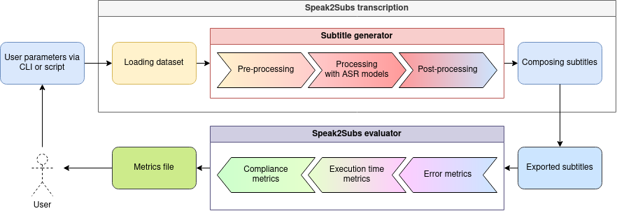

# Speak2Subs
Speak2Subs has three fundamental features: subtitle generation based on a reference template, subtitle quality evaluation, and subtitle generation without a reference template. This readme provides a concise introduction to each of these features, while subsequent sections describe the installation process, usage, and internal mechanics in more detail.



## Features
### Subtitle generation based on a reference template

One of the features is to generate subtitles. To correctly evaluate the ASR models on the table, we need to put them to the test and generate captions from datasets. But it is not enough to have subtitles, for the evaluation to be viable we need to compare them with the already original, presumably correct, subtitles. This implies that the generated subtitles must have the same timestamps as the original subtitles.

To make it clear, if our original subtitle contains the following entry:

    [00:00:02.000] --> [00:00:06.000] Buenos días, esto es una prueba.

Our generated subtitle could not have the following structure:

    [00:00:02.000] --> [00:00:03.000] Buenos días
    [00:00:04.000] --> [00:00:06.000] Eso es una rueda.

Because when it comes to comparing texts, there is clearly no match.
Obviously by restructuring timestamps we obtain the equivalences:

    [00:00:02.000] --> [00:00:06.000] Buenos días, esto es una prueba.
    [00:00:02.000] --> [00:00:06.000] Buenos días, eso es una rueda.

In conclusion, to evaluate subtitles we need to previously load the original subtitles as a template. So, one of the usage of this package, is to **generate subtitles using a template**.

As a disadvantage of using templates, the package is limited to the original structure, and may not be able to adjust the compliance parameters as it would in templateless generation.

### Subtitle quality evaluation
This package allows you to evaluate the quality of a subtitle file based on a reference file. Although this feature is what has been used for the evaluation phase, it is not necessary that the subtitles to be evaluated have been generated by this same package. The only requirement is that both files share timestamps and number of entries.

### Subtitle generation without a reference template

Of course, you can also generate subtitles without a base template. In fact, it is the functionality that gives value to the package beyond just as an evaluator.

With this functionality, the grouping of the transcribed words (tokens) into sentences and, in turn, subtitles, must follow the compliance policies described in the evaluation section.

A contraindication of these subtitles is that we cannot evaluate the error metrics, but we do have information on generation time metrics and compliance with the UNE.


## Installation
Before installing the package, some requisites are needed.

### Install PyTorch
PyTorch is an open-source machine learning library used for various tasks like natural language processing, computer vision, and more. It provides tools for building and training neural networks, offering flexibility and efficiency in experimentation due to its dynamic computational graph feature. Speak2Subs needs Torch to be installed.

The command must be adjusted to your requirements:
[PyTorch](https://pytorch.org/get-started/locally/)

### Install Docker
Docker is a platform designed to make it easier to create, deploy, and run applications using containers. Containers allow developers to package up an application with all the necessary parts (such as libraries and other dependencies) and ship it as a single unit. Docker provides a way to automate the deployment of applications inside containers, ensuring consistency across different environments, from development to testing and production. Since Speak2Subs uses containerized ASR models, Docker needs to be installed.
[Docker](https://docs.docker.com/engine/install/)

```bash
pip install docker
```
### Install Speak2Subs
Finally, Speak2Subs can be installed. The package has a few more dependencies, but they are automatically installed at the same time.

#### From Pypi
```bash
pip install speak2subs
```
#### From source code
Alternatively, this command pulls and installs the latest commit from this repository, along with its Python dependencies:
```bash
git clone https://github.com/JulioFresneda/Speak2Subs.git
cd Speak2Subs
pip install -e .
```

## Usage

This package can be used directly via CLI, and in a Python script. 

This package can be utilized both via the command line and within a Python script, for both generating subtitles and evaluating them. The package design is oriented towards a dataset style, meaning it defaults to working with folders of files. However, it can also be specified to generate or evaluate a specific file. The following sections will explain specific examples.

### How to generate subtitles
Speak2Subs supports MP4 and WAV files. When using MP4, it automatically converts them to WAV format. Optionally, if original VTT files are available, similar timestamped subtitles can be generated based on the original VTT as a template. 

To generate subtitles, all MP4 or WAV files (and VTT files if desired) should be in the same folder. If VTT files are present, they must share the same name as the media file, disregarding the extension. If no dataset name is specified, the name of the folder containing the files is used. To export the results, a folder needs to be specified where the generated VTT files will be exported.

Individual files are compatible too, the only difference in usage is that instead of using a path for the dataset folder, a path for the media file is needed

#### Command Line Interface usage
If you want to generate subtitles
```bash
speak2subs --media-path="./mydataset" --export_path="./results"
```

You can choose the ASR models to use. Default is whisperx.
```bash
speak2subs -mp="./mydataset" -ep="./results" --asr="nemo, whisper"
```

If you want to generate subtitles and use original VTT as reference
```bash
speak2subs -mp="./mydataset" -ep="./results" --use_vtt_templates
```

If you want to generate subtitles for a particular file
```bash
speak2subs -mp="./mydataset/media_1.wav" -ep="./results" --use_vtt_templates
```

If you want to get the full list of arguments
```bash
speak2subs --help
```

#### Python usage
It is as easy as with CLI to use this package in a python script.
```python
from Speak2Subs import speak2subs

speak2subs.transcript('./mydataset',
                      export_path='./results',
                      asr='all',
                      use_vad=True,
                      segment=True,
                      group_segments=False,
                      max_speech_duration=30,
                      use_vtt_template=True,
                      reduce_noise=False)
```

### How to evaluate subtitles
If subtitles have been previously generated, using the original subtitles as a reference, it is possible to evaluate the outcomes without effort. Much like the process for generating results, the original media folder is required to read the original subtitles, alongside the results folder to read the generated subtitles. The sole distinction lies in the additional parameter 'evaluate' that must be utilized. As straightforward as that. The result is an Excel file with all the metrics evaluated.

#### Command Line Interface usage
First we generate subtitles
```bash
speak2subs --media-path="./mydataset" --export_path="./results" --asr="seamless, vosk"
```

Then we evaluate them
```bash
speak2subs -mp="./mydataset" -ep="./results" --evaluate
```

We can evaluate a pair of VTT too
```bash
speak2subs --evaluate --ref_vtt_path="./reference.vtt", --pred_vtt_path="./predicted.vtt"
```
If we chose to evaluate a pair of VTT instead of the results of a generation, instead of an Excel with metrics, the result is an output on the terminal.

We can use more arguments, but it won't take effect because the rest of them are focused on the generation task.

#### Python usage
You can use it in python too.
```python
from Speak2Subs import speak2subs
from Speak2Subs import speak2subs

# If we want to evaluate the generated subtitles for our dataset
speak2subs.evaluateFolder( "./mydataset", "./results")
# If we want to evaluate a specific pair of subtitles
result = speak2subs.evaluatePair("./media_1.vtt", "./media_1_PRED_.vtt")
```

